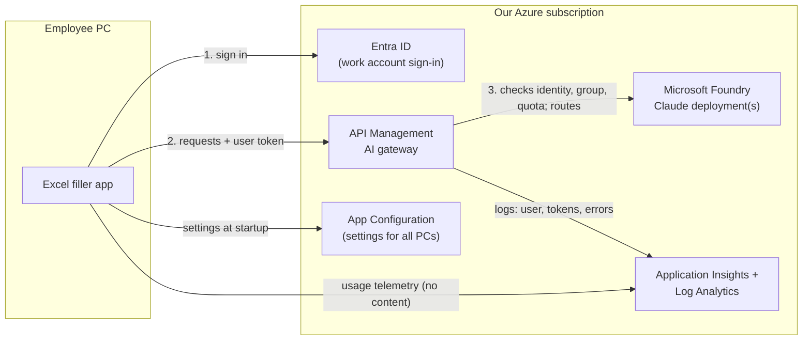

# Proposal: rolling out Excel filler to employees

*Prepared by IT — for review and decision.*

## Summary

Excel filler is a desktop app that fills Excel workbooks from PDF documents (invoices,
statements, reports) using Claude, an AI model we run in our own Azure subscription (Microsoft
Foundry). Employees review and approve every change before it is saved.

The app works today for a single user with developer tooling. Before giving it to employees, we
propose to put a **central gateway (Azure API Management)** between the app and the AI model and
to have employees **sign in with their Microsoft work account**. This gives IT:

- **control over who can use it** (an Entra ID group), with no secret keys on laptops;
- **the ability to change the AI model, region or endpoint centrally**, without reinstalling the app;
- **visibility**: number of users, usage per user and department, costs, errors;
- **protection**: per-user quotas so that no single user can exhaust the service or the budget.

We ask for approval to build this in three phases (below) and for the decisions listed at the end.

## What the app does today

| | |
|---|---|
| **For the employee** | Choose a folder, pick the workbook and the documents, press *Fill workbook*. The app reads the workbook first to see which fields are needed, reads only the relevant pages, proposes the values as a table of cell changes, and saves them only after approval. It never invents a value: missing or ambiguous information is asked or left empty, and the source of each value (file and page) is listed at the end. |
| **Safety built in** | A copy of the previous workbook is kept before every save. The app cannot run code, delete files or access the internet; it only reads the chosen folder and edits the chosen workbook. |
| **Status** | Working prototype. It runs on Windows and connects to our Foundry deployment; automated tests cover the main flows (a full filling job, approvals, stopping a job). Validation on real documents is the purpose of the pilot. |

## The problem with the current setup

- Each user would need the Foundry **endpoint and a key** (or developer tools) on their PC.
  Keys can leak and cannot be tied to a person.
- **Changing the model or endpoint** would mean updating every PC.
- IT has **no view** of who uses it, how much, what it costs, or when it fails.

## Proposed architecture

1. The employee signs in with their work account (single sign-on on company PCs).
2. The app sends its requests to **one fixed gateway address** (API Management), with the
   employee's identity.
3. The gateway checks that the employee belongs to the authorized group, applies quotas, and
   forwards the request to the right Foundry deployment. It logs who used how much.

## What IT gets

| Need | How it is covered |
|---|---|
| **Control access** | Only members of an Entra ID group (e.g. "Excel filler users") can use the service. Removing someone from the group removes access immediately. No API keys on PCs. |
| **Change the model or endpoint** | Done in the gateway: switch deployment, model version or region, or test a new model on a pilot group — every PC follows immediately, nothing to reinstall. |
| **Know how many users** | Entra ID sign-in logs (distinct users per day/month); gateway logs (requests and usage per user); app telemetry (jobs started and completed, app version per PC). |
| **Monitor and alert** | Azure Monitor dashboards and alerts on errors, response times, capacity limits and spend. |
| **Control costs** | Per-user quotas in the gateway; usage and cost per user and department from the gateway logs. |
| **Adjust the app without redeploying** | Settings (model name, telemetry, minimum supported version) are read by the app at startup from a central configuration; outdated versions can be required to update. |
| **Deploy and update** | Signed Windows installer distributed through Intune. |

## Security and privacy

- **No secrets on laptops**: access is based on the employee's identity, managed in Entra ID.
- **Data stays in our tenant**: documents are sent only to our own Foundry deployment, in the
  region we choose. The app keeps working files on the employee's PC only.
- **Telemetry without content**: by default we log counts and metadata (user, time, number of
  requests, tokens, errors, app version) — **never document contents or prompts**.
- **Human in control**: every change to a workbook is shown and approved before it is saved, and
  the previous version is kept.
- **To confirm with the Data Protection Officer** (and the works council, if applicable): the
  telemetry described above and the information given to employees.

## Costs

The main cost drivers, to be estimated with our Azure account team or the Azure pricing
calculator for the expected number of users:

| Item | Driver |
|---|---|
| Claude usage in Foundry | Volume of documents processed (tokens). The largest item; controlled by per-user quotas. |
| API Management | Tier chosen (a v2 tier suits this use); can be shared with other internal AI apps. |
| Application Insights / Log Analytics | Volume of logs kept and retention period. |
| App Configuration | Small. |
| Code-signing certificate (or Azure Trusted Signing) | Needed so that Windows does not warn employees at installation. |

## Plan

| Phase | Deliverables | Outcome |
|---|---|---|
| **1. Platform** | Infrastructure as code (Bicep) for the gateway and its policies (identity and group check, quotas, routing, logging), monitoring workspace, central configuration, a first dashboard. Entra ID app registration and user group. | The service is secured and observable. |
| **2. App** | Work-account sign-in, calls through the gateway, settings read at startup, usage telemetry without content, minimum-version check. | The app is ready for employees. |
| **3. Rollout** | Signed Windows installer built automatically, Intune deployment, pilot with a small group, short user guide. | Pilot users, then general availability. |

We recommend a **pilot with 5–10 employees** from one department before general availability, to
validate usefulness, quotas and costs.

## Decisions needed

1. **Approval** of the gateway architecture and of the three phases.
2. **API Management**: reuse an existing instance or create a new one?
3. **Entra ID**: who creates the app registration and the user group (IT identity team)?
4. **Telemetry**: agreement to collect usage telemetry without document content (with DPO review).
5. **Code signing**: an existing certificate, or Azure Trusted Signing?
6. **Pilot**: which department and which users.
